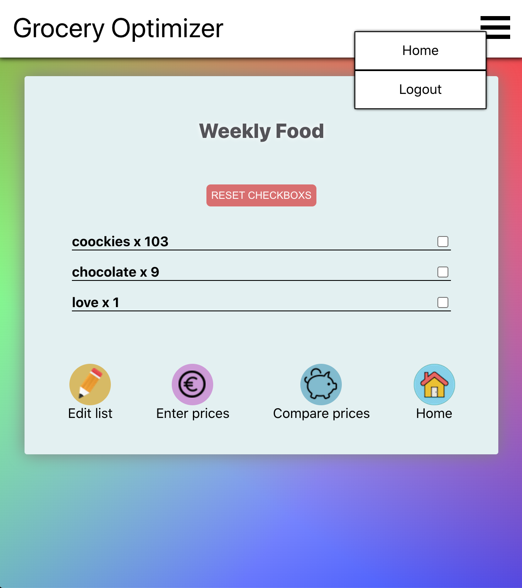

# Grocery Optimizer | Shopping lists and tracking spent money on them

## What this app is about

[Here is the working version](https://relaxed-roentgen-f2a31b.netlify.app/login)

The idea was to create shopping list collection and being able to keep track of how much money was spent on certain amount of products in different stores and compare in which store they are cheaper. Later I want to implement ability to see history of certain product price changes.

### App demo

### Used technologies and concepts

- [React for UI building](https://github.com/katerynapidhorna/grocery-optimizer-front/blob/development-front/src/index.js)
- [Apollo Client](https://github.com/katerynapidhorna/grocery-optimizer-front/blob/development-front/src/App.js)
- [Express as web app framework](https://github.com/katerynapidhorna/grocery-optimizer-back/blob/development/server.js)
  - \*\* [GraphQL API](https://github.com/katerynapidhorna/grocery-optimizer-back/blob/development/server.js)
- [Sequelize as ORM](https://github.com/katerynapidhorna/grocery-optimizer-back/blob/development/server.js)
- [Authentication](https://github.com/katerynapidhorna/grocery-optimizer-back/tree/development/routers)
- [Database Models](https://github.com/katerynapidhorna/grocery-optimizer-back/tree/development/models)

\*\* - New technology learned during this project

### Goals for this project

The goal of this project is to practice building a full-stack app and master new technology(\*\* see above). I learned this tool myself by reading documentation, searching information on forums and watching online tutorials.

- practice full-stack app development
- build a working example in 2 weeks
- apply what I have learned during Academy
- showcase and document development skills using:
  - wireframes as Minimum Viable Product
  - data modeling
  - user stories
  - Agile [kanban project](https://github.com/users/katerynapidhorna/projects/1)
  - git version control

### User stories

- As a user I want to be able to login with email and password
- On a home page I want to see all my lists and create New list button
- As a user I want to be able to create a new shopping list, so I can make shopping lists for different occasions
- As a user I want to be able to add a new item to my list, so it stays relevant
- As a user I want to be able to specify the quantity of an item, so my list stays organized
- As a user I want to be able to remove an item from my list, so it stays relevant
- As a shopper I want to be able to edit an item on my list, so it stays relevant
- In the list view page I am able to check items out
- In the list view page I can see Enter prices/ Edit/ Compare stores buttons and Reset button to uncheck all items
- If I click Compare stores button I see list of products and their prices per chosen store and total prices
  - I can add stores for comparison of total price of the list
  - If some product price unknown I exclude it from comparison of total prices and show the alert message
- Every page except login page has navigation to home page and log out button
- If I click Enter prices button I am able to enter price for each product in the list and specify the store name
  - Enter prices page has Submit button
- (planned): As a user I can see how prices changed for certain products in diagram

This is "work in progress" project. There are features I want to improve or reconsider

### Project Board

Go to [project board](https://github.com/users/katerynapidhorna/projects/1)

### Wireframe

Go to [wireframe](https://wireframepro.mockflow.com/view/M951f31687368b6cd22a4f2998f633d1f1595231762262#/page/d35b5c6e58d3445c8d2068d8e788bea3)

### Data model

Go to [datamodel](https://app.lucidchart.com/documents/view/75b6592e-19db-4b79-ad03-0e1563381636/0_0)

### Frontend repository

The [frontend side](https://github.com/katerynapidhorna/grocery-optimizer-front)

### Backend server repository

The [backend project](https://github.com/katerynapidhorna/grocery-optimizer-back) is an Express-GraphQl server using Sequelize to manage PostgreSQL database
